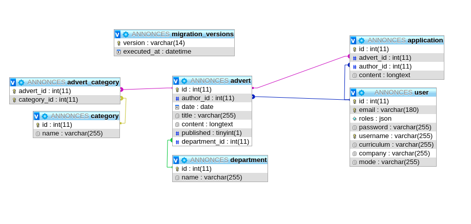

# Ads

## 3WA/SensioLabsUniversity Project
[](https://insight.symfony.com/projects/264de5a7-6207-4608-b77b-6b54c39c2594)
[](https://www.codacy.com/app/sergisergio/Ads?utm_source=github.com&amp;utm_medium=referral&amp;utm_content=sergisergio/Ads&amp;utm_campaign=Badge_Grade)
[](https://scrutinizer-ci.com/g/sergisergio/Ads/?branch=master)
[](https://codeclimate.com/github/sergisergio/Ads/maintainability)
#### Travis CI [](https://travis-ci.org/sergisergio/Ads)
#### Scrutinizer CI [](https://scrutinizer-ci.com/g/sergisergio/Ads/build-status/master)
#### Circle CI [](https://circleci.com/gh/sergisergio/Ads)
#### Codeship CI [](https://app.codeship.com/projects/327330)


### First step

-  [Template](https://www.free-css.com/free-css-templates/page220/gp)
- User Entity created (with constraints and Unique Entity)
- plainPasswordField
- SecurityController with register, login and logout methods.
- Set up config/packages/security.yaml (encoder, provider and firewall).
- RegistrationFormType.
- login.html.twig and register.html.twig
- AgreeTerms and remember_me
- UserFixtures
- Condition "is_granted" in navbar.
- token and validation added in User Entity (see User Checkers)

Security DOC:
[SF DOC Security](https://symfony.com/doc/current/security.html)
[SFDOC LOGIN FORM](https://symfony.com/doc/current/security/form_login_setup.html)
[SF DOC form_login Authentication Provider](https://symfony.com/doc/current/security/form_login.html)
[SF DOC remember me functionality](https://symfony.com/doc/current/security/remember_me.html)
[SF DOC CSRF protection](https://symfony.com/doc/current/security/csrf.html)
[SF DOC registration form](https://symfony.com/doc/current/doctrine/registration_form.html)
[SymfonyCasts Security](https://symfonycasts.com/screencast/symfony-security)
[Users Checkers](https://symfony.com/doc/current/security/user_checkers.html)

- Advert Entity created (with constraints and Unique Entity)
- relation ManyToOne with User Entity (author field).
- AdvertController, AdvertFixtures, for loop in Twig to see all adverts.
- Twig view to see one advert.
- Pagination done.
- AddAdvertType form created.
- CRUD done with this entity.

DOC:
[SF DOC Doctrine](https://symfony.com/doc/current/doctrine.html)
[SF DOC Relations](https://symfony.com/doc/current/doctrine/associations.html)
[SF DOC Fixtures](https://symfony.com/doc/current/bundles/DoctrineFixturesBundle/index.html)
[SF DOC Validation](https://symfony.com/doc/current/validation.html)
[SymfonyCasts Pagination](https://symfonycasts.com/screencast/doctrine-relations/pagination)

- Application Entity created
- relation ManyToOne with User Entity (author field)
- relation ManyToOne with Advert Entity (advert field)
- ApplicationController,  ApplicationType form.
- possibility to send an application to an advert.

### Step 2

- Category Entity created (with constraints and Unique Entity)
- relation ManyToMany with Advert Entity ( categories field).
- addAdvertType modified (EntityType, class Category, multiple)
- CategoryFixtures and categories can be seen in templates (index & view.html.twig)
- Add and Edit an advert with some categories works.
- We have now 4 entities :
1) User related to Advert (OneToMany) and Application (OneToMany).
2) Advert related to User (ManyToOne), Application (OneToMany) and Category (ManyToMany).
3) Application related to User (ManyToOne) and Advert (ManyToOne).
4) Category related to Advert (ManyToMany).

### Step 3

- Department Entity created
- relation OneToMany with Advert Entity (department field).
- DepartmentType form created.
- addAdvertType modified including DepartmentType so that we can see now where the advert is.
- DepartmentFixtures has been done with all french departments.
- Admin part has been enhanced:
- Admin can now change the User's role.
- Admin can now validate an advert.
- Admin can add or delete a category.

### Step 4

- Start Account Page
- Possibility to see my created adverts
- Possibility to see applications for those adverts.
- Add Flash messages.

### Step 5

- User can upload his curriculum vitae now.
- Roles have been defined: ROLE_RECRUITER and ROLE_CANDIDATE
- When registering, we must choose recruiter or candidate with a ChoiceType form.
- So in Twig, you don't see the same things wether you're a recruiter or not.
- UserFixtures changed consequently.
- A UploadFile Service has been done and used in AccountController.
- installed phpunit-bridge
- installed browser-kit
- installed css-selector
- vendor/bin/simple-phpunit (see Tests)
- vendor/bin/simple-phpunit --coverage-html {path} (see Tests in a browser)
- vendor/bin/simple-phpunit --testdox (pour voir ce qui est testé)
- vendor/bin/simple-phpunit --testdox-html {path}
- Natif à PHP5.6: phpdbg -qrr phpunit --coverage-html=.... (il faut XDEBUG: php --ri xdebug)
- Pour les tests, je désinstalle simple-phpunit et je passe par [test-pack](https://packagist.org/packages/symfony/test-pack)
- Puis bin/phpunit
- bin/phpunit --coverage-html var/phpunit
DOC:
[SYMFONY DOC UPLOAD FILE](https://symfony.com/doc/current/controller/upload_file.html)
[SYMFONY DOC HIERARCHICAL ROLES](https://symfony.com/doc/current/security.html#hierarchical-roles)



### Step 6: a bit of quality/performance

- install PHPMetrics (vendor/bin/phpmetrics --report-html=doc/phpmetrics ./src )
- install PHPCodeSniffer (vendor/bin/phpcs et vendor/bin/phpcbf)
- install PHPMessDetector (vendor/bin/phpmd src/ html unusedcode --reportfile phpmd.html)
- install PHP Copy/Paste Detector (vendor/bin/phpcpd . )
- install Behat
- Badge Scrutinizer
- Badge CodeClimate

[PHPMetrics](https://github.com/phpmetrics/PhpMetrics)
[PHPCodeSniffer](https://github.com/squizlabs/PHP_CodeSniffer)
[PHPMessDetector](https://github.com/phpmd/phpmd)
[PHP Copy/Paste Detector](https://github.com/sebastianbergmann/phpcpd)
[DOC PHPMD](https://phpmd.org/rules/index.html)
[Behat](https://packagist.org/packages/behat/behat)

### Step 7: makefile

- tests, quality, install
- Beware of indentation: cat -e -t -v makefile

### Step 8: CI

- [Travis CI](https://travis-ci.org/) (Voir fichier .travis.yml à la racine).
- [Scrutinizer CI](https://scrutinizer-ci.com)
- [Circle CI](https://circleci.com/) (Voir .circleci/config.yml à la racine).
- [Codeship CI](https://codeship.com/) (configuration online/Vérifier version PHP).

DOC SYMFONY && autres:
[Testing](https://symfony.com/doc/current/testing.html)
[Customize Bootstrap Process before Running Tests](https://symfony.com/doc/current/testing/bootstrap.html)
[Tests](https://symfony.com/doc/current/best_practices/tests.html)
[PHPUNIT](https://phpunit.de/)
[Simulate HTTP Authentication in a Functional Test](https://symfony.com/doc/current/testing/http_authentication.html)
[Test Code interacting with the database](https://symfony.com/doc/current/testing/database.html)
[Test Doctrine repositories](https://symfony.com/doc/current/testing/doctrine.html)
[DOMCrawler Component](https://symfony.com/doc/current/components/dom_crawler.html)
[CssSelector Component](https://symfony.com/doc/current/components/css_selector.html)

Voir également:
[Jenkins](https://jenkins.io/)
[TeamCity](https://www.jetbrains.com/teamcity/)
[Gitlab CI](https://about.gitlab.com/product/continuous-integration/)
[Buddy](https://buddy.works/)

### Step 9: API

[API Platform](https://api-platform.com/)
[JWT](https://github.com/lexik/LexikJWTAuthenticationBundle) [TUTO JWT](https://api-platform.com/docs/core/jwt/)
[OAuth](https://github.com/FriendsOfSymfony/FOSOAuthServerBundle) [TUTO OAuth](https://oauth.net/)
[Postman](https://www.getpostman.com/)
[Richardson Model](https://martinfowler.com/articles/richardsonMaturityModel.html)


**Generate the SSH keys with JWT**

``` bash
$ mkdir -p config/jwt
$ openssl genrsa -out config/jwt/private.pem -aes256 4096
$ openssl rsa -pubout -in config/jwt/private.pem -out config/jwt/public.pem
```

Be careful: you must put the key you chose in the .env file

**Test Getting a token**

```bash
curl -X POST -H "Content-Type: application/json" {yourdomain}/api/login_check -d '{"username":"{yourusername}", "password":"{yourpassword}"}'
```
**Authentification**

```bash
curl -H "Authorization: Bearer {yourtoken}" {yourdomain}/api
```

### Step 9: Test Docker

[DOC DOCKER](https://docs.docker.com/)
[DOCKER HUB](https://hub.docker.com/search/?q=&type=image)
Le docker Hub est un store où les utilisateurs de docker peuvent partager leurs images.
Installer une image: ```docker pull [image]  ```
Gérer une image: ```docker image [command]  ```
Lister les images téléchargées: ```docker image ls  ```
Supprimer une image: ```docker image rm [nom ou ID image]  ```

Vérifier les containers: ```docker container ls -a ```
Supprimer un container: ```docker container rm [container]```

- -t : fournit un terminal au docker.
- -i : permet d'écrire dans le conteneur (couplé à -t)
- -d : exécute le conteneur en arrière-plan.
- -v : permet de monter u nrépertoire local sur le conteneur.
- -p : permet de binder un port sur le conteneur vers un port sur le host.

Le Dockerfile est un fichier qui contient toutes les instructions pour créer une image.

Liste des instructions:
```
FROM # Pour choisir l'image sur laquelle on se base, toujours en premier
RUN # Permet d'exécuter une commande
CMD # Commande exécutée au démarrage du conteneur par défaut
EXPOSE # Ouvre un port
ENV # Permet d'éditer des variables d'environnement
ARG # Un peu comme ENV, mais seulement le temps de la construction de l'image
COPY # Permet de copier un fichier ou répertoire de l'hôte vers l'image
ADD # Permet de copier un fichier de l'hôte ou depuis une URL vers l'image, permet également de décompresser une archive tar
LABEL # Des métadonnées utiles pour certains logiciels de gestion de conteneurs, comme rancher ou swarm, ou tout simplement pour mettre des informations sur l'image.
ENTRYPOINT # Commande exécutée au démarrage du conteneur, non modifiable, utilisée pour package une commande
VOLUME # Crée une partition spécifique
WORKDIR # Permet de choisir le répertoire de travail
USER # Choisit l'utilisateur qui lance la commande du ENTRYPOINT ou du CMD
ONBUILD # Crée un step qui sera exécuté seulement si notre image est choisie comme base
HEALTHCHECK # Permet d'ajouter une commande pour vérifier le fonctionnement de votre conteneur
STOPSIGNAL # permet de choisir le [signal](http://man7.org/linux/man-pages/man7/signal.7.html) qui sera envoyé au conteneur lorsque vous ferez un docker container stop
```

Construire l'image:
```docker image build -t [imagename]:[tag] [dockerfile folder]```
Exemple: ```docker image build -t philippe/apache . ```

Tester l'image:
```docker container run -ti -p 80:80 philippe/apache ```

See this [REPO](https://gitlab.com/Guikingone/Practice)

A ce stade, voici ce que j'ai:

```docker build -t philippe . ```
Les étapes de construction du Dockerfile se déroulent.

```docker ps -a```
Cela permet de voir l'ID du container et l'image.

```docker-compose up```

```docker-compose exec [nom_du_service] sh```

A ce moment, si je fais un ```php -v```, j'obtiens une 7.1 alors que je suis en 7.2

```docker-compose ps``` vérifie que tout est lancé (le state doit être en Up)

Note: si je veux d'autres services type nginx, phpmyadmin, redis et autres, il faut les ajouter dans docker-compose.yaml.

Voir aussi ce [REPO GITHUB](https://github.com/maxpou/docker-symfony) très intéressant.

### Step 10: Test Blackfire

[Blackfire](https://blackfire.io/)
[Les 5 principaux composants de Blackfire](https://blackfire.io/docs/reference-guide/faq)
[Blackfire Doc](https://blackfire.io/docs/introduction)
Voir fichier .blackfire.yml à la racine

### Step 11: CacheKernel

[HTTP Cache](https://symfony.com/doc/master/http_cache.html)


